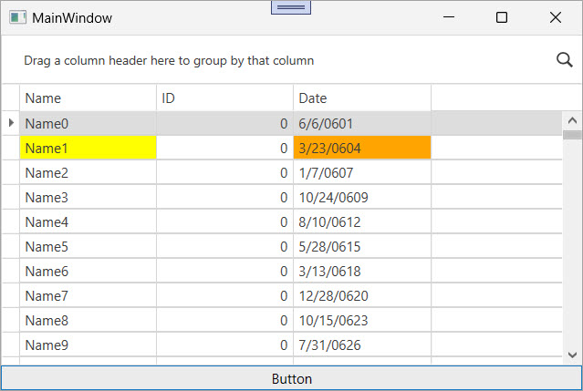

<!-- default badges list -->

[](https://supportcenter.devexpress.com/ticket/details/E4181)
[](https://docs.devexpress.com/GeneralInformation/403183)
[](#does-this-example-address-your-development-requirementsobjectives)
<!-- default badges end -->

# WPF Grid - Highlight Specific Cells

The [`GridControl`](https://docs.devexpress.com/WPF/DevExpress.Xpf.Grid.GridCell.GridControl) allows you to change a cell color based on underlying data source. For this, you can define a custom [`CellStyle`](https://docs.devexpress.com/WPF/DevExpress.Xpf.Grid.DataViewBase.CellStyle) with the corresponding bindings:

```xaml
<Style x:Key="customCellStyle" >
	<Setter Property="Background" Value="{Binding Path=RowData.Row.SomeFieldName, Converter={local:YourConverter}}"/>
</Style>
``` 

If you need to highlight a cell in a certain column and a certain row without any dependencies on the underlying data, you can store information about target cells in a separate collection and use the information by each cell through the `CellStyle` property. You can target any cell and apply a color at runtime. Use this technique for validation, cross-row checks, or external rules without any column redesign or data model changes.



## Implementation Details

### Target Cell and Color

The code example defines the `HighlightedGridCell` type to store color data for a target cell:

```csharp
public class HighlightedGridCell {
    public HighlightedGridCell(object row, GridColumn column, Color color) {
        Row = row; Column = column; Color = color;
    }
    public object Row { get; set; }
    public GridColumn Column { get; set; }
    public Color Color { get; set; }
}
```

### Highlighted Cell Collection

The code example defines the `CellsToHighlight` attached property of the `ObservableCollection<HighlightedGridCell>` type . This property is attached to the `GridControl` and stores highlighted cells:

```csharp
public static class CellsHighlightHelper {
    public static readonly DependencyProperty CellsToHighlightProperty = DependencyProperty.RegisterAttached(
		"CellsToHighlight", 
		typeof(ObservableCollection<HighlightedGridCell>), 
		typeof(CellsHighlightHelper), null
	);
    public static ObservableCollection<HighlightedGridCell> GetCellsToHighlight(DependencyObject target) {
        return (ObservableCollection<HighlightedGridCell>)target.GetValue(CellsToHighlightProperty);
    }
    public static void SetCellsToHighlight(GridControl target, ObservableCollection<HighlightedGridCell> value) {
        target.SetValue(CellsToHighlightProperty, value);
    }
}
```

```csharp
public MainWindow() {
	InitializeComponent();
	ObservableCollection<HighlightedGridCell> cellsToHiglight = new ObservableCollection<HighlightedGridCell>();
	cellsToHiglight.Add(new HighlightedGridCell(gridControl1.GetRow(0), gridControl1.Columns["ID"], Colors.Red));
	CellsHighlightHelper.SetCellsToHighlight(gridControl1, cellsToHiglight);
}

private void button1_Click(object sender, RoutedEventArgs e) {
	ObservableCollection<HighlightedGridCell> cellsToHiglight = new ObservableCollection<HighlightedGridCell>();
	cellsToHiglight.Add(new HighlightedGridCell(gridControl1.GetRow(1), gridControl1.Columns["Name"], Colors.Yellow));
	cellsToHiglight.Add(new HighlightedGridCell(gridControl1.GetRow(1), gridControl1.Columns["Date"], Colors.Orange));
	CellsHighlightHelper.SetCellsToHighlight(gridControl1, cellsToHiglight);
}
```

### Cell Background

Once the collection is defined in the `CellsToHighlight` attached property, this collection can be used at the cell style level. For this, define a `MultiBinding` in a custom `CellStyle`. The `MultiBinding` uses three inputs:

* The attached collection of highlighted cells

* The current row object

* The current column

Based on these inputs, the converter returns a brush for the corresponding cell:

```xaml
<dxg:TableView.CellStyle>
    <Style TargetType="dxg:LightweightCellEditor">
        <Style.Resources>
            <local:BindingToColorConverter x:Key="converter" />
        </Style.Resources>
        <Setter Property="Background">
            <Setter.Value>
                <MultiBinding Converter="{StaticResource converter}">
                    <Binding Path="(local:CellsHighlightHelper.CellsToHighlight)" 
                             RelativeSource="{RelativeSource AncestorType=dxg:GridControl}" />
                    <Binding Path="RowData.Row" />
                    <Binding Path="Column" />
                </MultiBinding>
            </Setter.Value>
        </Setter>
    </Style>
</dxg:TableView.CellStyle>
```

### Color Converter

The following code example creates a color converter that receives the `HighlightedGridCell` collection, a row, and a column. If the collection contains a record with target row and column, a new `SolidColorBrush` is created based on the color in that record:

```csharp
public class BindingToColorConverter : DependencyObject, IMultiValueConverter {
	object IMultiValueConverter.Convert(object[] values, Type targetType, object parameter, System.Globalization.CultureInfo culture) {
		ObservableCollection<HighlightedGridCell> cellsToHighlight = values[0] as ObservableCollection<HighlightedGridCell>;
		object row = values[1];
		object column = values[2];
		return GetColorToHighlight(row, column, cellsToHighlight);
	}
	object[] IMultiValueConverter.ConvertBack(object value, Type[] targetTypes, object parameter, System.Globalization.CultureInfo culture) {
		throw new NotImplementedException();
	}
	private object GetColorToHighlight(object row, object column, ObservableCollection<HighlightedGridCell> cellsToHighlight) {
		if (row == null || column == null || cellsToHighlight == null)
			return null;
		foreach (HighlightedGridCell cell in cellsToHighlight) {
			if (cell.Column == column && cell.Row == row)
				return new SolidColorBrush(cell.Color);
		}
		return null;
	}
}
```

## Files to Review

* [MainWindow.xaml](./CS/MainWindow.xaml) (VB: [MainWindow.xaml](./VB/MainWindow.xaml))
* [MainWindow.xaml.cs](./CS/MainWindow.xaml.cs) (VB: [MainWindow.xaml.vb](./VB/MainWindow.xaml.vb))
* [DataHelper.cs](./CS/Model/DataHelper.cs) (VB: [DataHelper.vb](./VB/Model/DataHelper.vb))
* [ViewModel.cs](./CS/ViewModel/ViewModel.cs) (VB: [ViewModel.vb](./VB/ViewModel/ViewModel.vb))
* [BindingToColorConverter.cs](./CS/ColorHelper/BindingToColorConverter.cs) (VB: [BindingToColorConverter.vb](./VB/ColorHelper/BindingToColorConverter.vb))
* [CellsHighlightHelper.cs](./CS/ColorHelper/CellsHighlightHelper.cs) (VB: [CellsHighlightHelper.vb](./VB/ColorHelper/CellsHighlightHelper.vb))
* [HighlightedGridCell.cs](./CS/ColorHelper/HighlightedGridCell.cs) (VB: [HighlightedGridCell.vb](./VB/ColorHelper/HighlightedGridCell.vb))

## Documentation

* [GridControl](https://docs.devexpress.com/WPF/DevExpress.Xpf.Grid.GridCell.GridControl)
* [TableView](https://docs.devexpress.com/WPF/DevExpress.Xpf.Grid.TableView)
* [Columns](https://docs.devexpress.com/WPF/6093/controls-and-libraries/data-grid/grid-view-data-layout/columns-and-card-fields)
* [CellStyle](https://docs.devexpress.com/WPF/DevExpress.Xpf.Grid.DataViewBase.CellStyle)

## More Examples

* [WPF Data Grid — Specify Custom Content for Column Chooser Headers](https://github.com/DevExpress-Examples/wpf-data-grid-custom-content-for-column-chooser-headers)
* [WPF Data Grid — Bind to Dynamic Data](https://github.com/DevExpress-Examples/wpf-bind-gridcontrol-to-dynamic-data)
* [Implement CRUD Operations in the WPF Data Grid](https://github.com/DevExpress-Examples/wpf-data-grid-implement-crud-operations)
* [WPF Grid — Resize Rows Using a Splitter](https://github.com/sergepilipchuk/wpf-grid-resize-rows-using-splitter)

<!-- feedback -->
## Does this example address your development requirements/objectives?

[](https://www.devexpress.com/support/examples/survey.xml?utm_source=github&utm_campaign=wpf-grid-highlight-specific-cells&~~~was_helpful=yes) [](https://www.devexpress.com/support/examples/survey.xml?utm_source=github&utm_campaign=wpf-grid-highlight-specific-cells&~~~was_helpful=no)

(you will be redirected to DevExpress.com to submit your response)
<!-- feedback end -->
